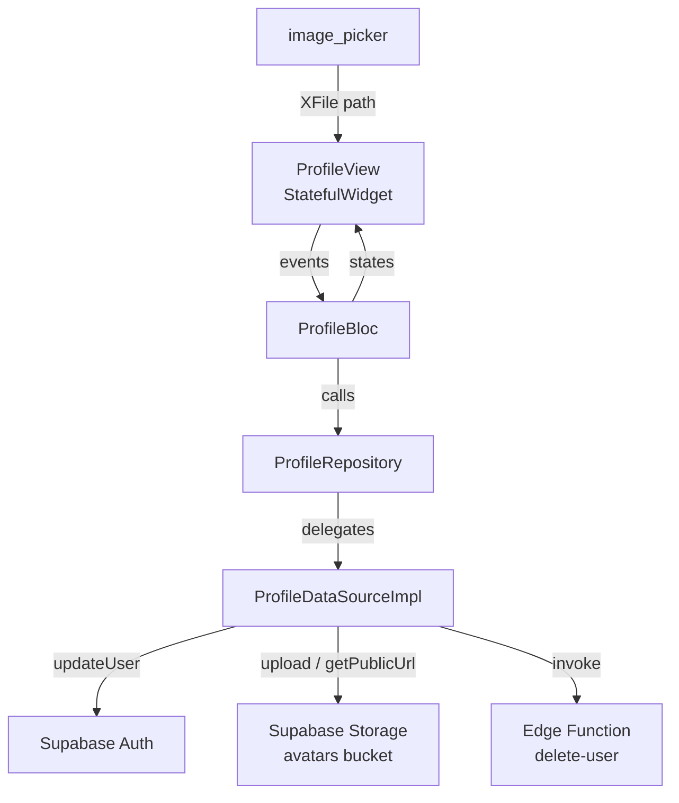
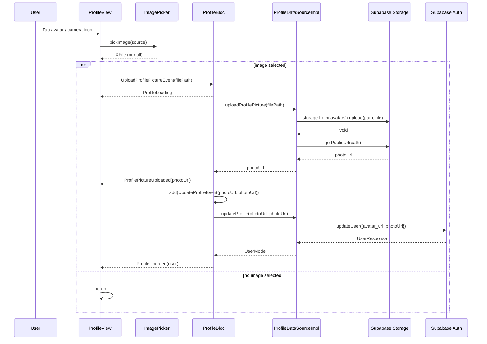

# Design Document: Profile Screen

## Overview

The Profile Screen gives authenticated users a single place to view and manage their profile: see their avatar and display name, upload a new photo, edit their display name, and permanently delete their account.

The feature builds on top of the existing `ProfileBloc` / `ProfileRepository` / `ProfileDataSource` stack that is already wired into the DI container. The UI follows the same `BlocConsumer` pattern used throughout the rest of the app.

### Key Design Decisions

- **No new BLoC, repository, or DI registration is needed.** `ProfileBloc`, `ProfileRepository`, `ProfileRepositoryImpl`, and the `ProfileDataSource` abstract class all exist and are already registered in `injection_container.dart`. Only `ProfileDataSourceImpl` needs its two TODO stubs filled in.
- **`ProfileDataSourceImpl` uses only `AuthClient`.** The user has already wired the constructor to accept `AuthClient`. Avatar upload will use `Supabase.instance.client.storage` directly (accessed as a singleton) rather than injecting `SupabaseClient`, keeping the constructor unchanged.
- **`ProfileBloc` handles the upload-then-update chain.** After `ProfilePictureUploaded` is emitted, the BLoC dispatches `UpdateProfileEvent` with the new `photoUrl`. The UI does not orchestrate multi-step logic.
- **Display name validation lives in the UI layer.** The 1–50 character rule is enforced in `ProfileView` before any event is dispatched, consistent with how other forms in the app validate before calling the BLoC.
- **Account deletion uses a Supabase Edge Function** (`delete-user`). The Supabase client SDK does not expose a direct `deleteUser` method for the authenticated user; deletion requires a service-role call that must be made server-side.
- **Supabase Storage path convention:** `avatars/{userId}/{timestamp}.jpg`. This scopes files per user and avoids collisions.

---

## Architecture

The feature follows the existing Clean Architecture layering:

```
Presentation  →  Domain  →  Data
ProfilePage      ProfileRepository (abstract)    ProfileDataSourceImpl
ProfileView      ProfileRepositoryImpl            ↓
ProfileBloc      UserEntity                      Supabase Auth (updateUser)
                                                 Supabase Storage (upload)
                                                 Supabase Functions (delete-user)
```



### Data Flow: Avatar Upload



---

## Components and Interfaces

### 1. ProfilePage (new — route entry point)

**Location:** `lib/features/auth/presentation/screens/profile_screen.dart`

```dart
class ProfilePage extends StatelessWidget {
  const ProfilePage({super.key});

  @override
  Widget build(BuildContext context) {
    return BlocProvider(
      create: (_) => sl<ProfileBloc>(),
      child: const ProfileView(),
    );
  }
}
```

### 2. ProfileView (new — StatefulWidget)

**Location:** same file as `ProfilePage`

Responsibilities:
- Read the current `UserEntity` from `SessionBloc` (`Authenticated` state).
- Use `BlocConsumer<ProfileBloc, ProfileState>` to react to state changes.
- Render the avatar `CircleAvatar` with a camera-icon overlay; show `CircularProgressIndicator` overlay during `ProfileLoading`.
- Render the display name with an edit `IconButton`; tapping opens an inline `TextField` or a bottom sheet.
- Render the email as a read-only `Text` widget.
- Invoke `ImagePicker` on avatar tap and dispatch `UploadProfilePictureEvent`.
- Validate display name (1–50 chars) before dispatching `UpdateProfileEvent`.
- Show a confirmation `AlertDialog` before dispatching `DeleteAccountEvent`.
- Navigate to `/login` via `Navigator.pushReplacementNamed` on `AccountDeleted`.
- Show a red `SnackBar` on `ProfileError`.

Key state variables:
```dart
bool _isEditingName = false;
late TextEditingController _nameController;
String? _nameError;
```

### 3. `validateDisplayName` (pure function — extracted for testability)

```dart
/// Returns an error message string, or null if valid.
String? validateDisplayName(String input) {
  final trimmed = input.trim();
  if (trimmed.isEmpty) return 'Display name cannot be empty';
  if (trimmed.length > 50) return 'Display name must be 50 characters or fewer';
  return null;
}
```

Extracted at file scope so it can be imported by property-based tests.

### 4. ProfileDataSourceImpl (updated — fill in two TODO stubs)

**Location:** `lib/features/auth/data/datasources/profile_datasource_impl.dart`

The constructor stays as-is (`AuthClient` only). The two stubs are implemented:

**`uploadProfilePicture`:**
```dart
@override
Future<String> uploadProfilePicture({required String filePath}) async {
  try {
    final userId = _authClient.currentUser!.id;
    final timestamp = DateTime.now().millisecondsSinceEpoch;
    final storagePath = '$userId/$timestamp.jpg';
    final file = File(filePath);

    await Supabase.instance.client.storage
        .from('avatars')
        .upload(storagePath, file, fileOptions: const FileOptions(upsert: true));

    final publicUrl = Supabase.instance.client.storage
        .from('avatars')
        .getPublicUrl(storagePath);

    return publicUrl;
  } catch (e) {
    throw ServerException('Failed to upload profile picture: ${e.toString()}');
  }
}
```

**`deleteAccount`:**
```dart
@override
Future<void> deleteAccount() async {
  try {
    await Supabase.instance.client.functions.invoke('delete-user');
  } on AuthException {
    rethrow;
  } catch (e) {
    throw ServerException('Failed to delete account: ${e.toString()}');
  }
}
```

> **Note on `updateProfile`:** The existing implementation uses the Dart 3.x null-aware spread syntax (`'name': ?displayName`). This is valid Dart 3.7+ syntax. No changes needed.

### 5. Route Registration (updated `main.dart`)

Add to the `routes` map:
```dart
'/profile': (context) => const ProfilePage(),
```

### 6. ProfileBloc — upload-then-update chain (updated)

After `ProfilePictureUploaded` is emitted, the BLoC must automatically dispatch `UpdateProfileEvent` to persist the new URL in Supabase Auth metadata. Update `_onUploadProfilePicture`:

```dart
Future<void> _onUploadProfilePicture(
  UploadProfilePictureEvent event,
  Emitter<ProfileState> emit,
) async {
  emit(const ProfileLoading());
  final result = await profileRepository.uploadProfilePicture(filePath: event.filePath);
  result.fold(
    (failure) => emit(ProfileError(message: failure.message)),
    (photoUrl) {
      emit(ProfilePictureUploaded(photoUrl: photoUrl));
      add(UpdateProfileEvent(photoUrl: photoUrl)); // chain: persist URL in metadata
    },
  );
}
```

---

## Data Models

### UserEntity (unchanged)

| Field | Type | Supabase source |
|---|---|---|
| `id` | `String` | `user.id` |
| `email` | `String` | `user.email` |
| `displayName` | `String?` | `userMetadata['name']` |
| `photoUrl` | `String?` | `userMetadata['avatar_url']` |
| `phoneNumber` | `String?` | `user.phone` |
| `isEmailVerified` | `bool` | `confirmationSentAt != null` |
| `createdAt` | `DateTime` | `user.createdAt` |

### Supabase Storage Layout

```
bucket: avatars
  └── {userId}/
        └── {timestamp}.jpg   (e.g. 1718000000000.jpg)
```

Files are uploaded with `upsert: true` so re-uploading replaces the previous file. The public URL is retrieved with `getPublicUrl`.

### Display Name Validation Rule

| Condition | Result |
|---|---|
| `trimmed.isEmpty` | Invalid — "Display name cannot be empty" |
| `trimmed.length > 50` | Invalid — "Display name must be 50 characters or fewer" |
| `1 ≤ trimmed.length ≤ 50` | Valid — dispatch `UpdateProfileEvent` |

---

## Correctness Properties

### Property 1: Display name validation accepts exactly the valid length range

For any string submitted as a display name, `validateDisplayName` SHALL return `null` if and only if the trimmed length is between 1 and 50 characters (inclusive), and SHALL return a non-null error string otherwise.

**Validates:** Requirements 3.2, 3.3

**Test approach:** Property-based test using `fast_check` with 100 randomly generated strings.

---

## Error Handling

### Exception → Failure mapping

| Exception (DataSource) | Failure (Repository) | BLoC state |
|---|---|---|
| `ServerException` | `ServerFailure` | `ProfileError(message)` |
| `AuthException` | `AuthFailure` | `ProfileError(message)` |
| Any other `Exception` | `ServerFailure('Unexpected error: ...')` | `ProfileError(message)` |

### UI error handling

- `ProfileError` → `ScaffoldMessenger.of(context).showSnackBar(...)` with red background.
- After the snackbar, all interactive elements are re-enabled (BLoC returns to non-loading state, `BlocBuilder` rebuilds with enabled controls).

### Edge cases

| Scenario | Handling |
|---|---|
| `photoUrl` is null | Show `Icon(Icons.person, size: 50)` placeholder in `CircleAvatar` |
| `displayName` is null | Show `user.email` as the display label |
| ImagePicker returns null (user cancelled) | No event dispatched; screen unchanged |
| Upload succeeds but `updateProfile` fails | `ProfileError` shown; file remains in Storage but metadata not updated — user can retry |
| Network unavailable | `ServerException` → `ProfileError` with human-readable message |
| Auth session expired | `AuthException` → `ProfileError`; user may need to re-login |

---

## Testing Strategy

### Unit Tests

**ProfileBloc** (`test/features/auth/presentation/bloc/profile/profile_bloc_test.dart`):
- `UploadProfilePictureEvent` → `[ProfileLoading, ProfilePictureUploaded]` on success, then auto-dispatches `UpdateProfileEvent`.
- `UploadProfilePictureEvent` → `[ProfileLoading, ProfileError]` on failure.
- `UpdateProfileEvent` → `[ProfileLoading, ProfileUpdated]` on success.
- `UpdateProfileEvent` → `[ProfileLoading, ProfileError]` on failure.
- `DeleteAccountEvent` → `[ProfileLoading, AccountDeleted]` on success.
- `DeleteAccountEvent` → `[ProfileLoading, ProfileError]` on failure.

**ProfileDataSourceImpl** (`test/features/auth/data/datasources/profile_datasource_impl_test.dart`):
- `uploadProfilePicture` calls Supabase Storage upload and returns a public URL.
- `uploadProfilePicture` throws `ServerException` on storage failure.
- `updateProfile` calls `updateUser` with correct metadata keys (`name`, `avatar_url`).
- `updateProfile` throws `AuthException` on auth failure.
- `deleteAccount` invokes the `delete-user` Edge Function.
- `deleteAccount` throws `ServerException` on function invocation failure.

**Display name validation** (`test/features/auth/presentation/screens/profile_screen_test.dart`):
- Empty string → invalid.
- Whitespace-only string → invalid.
- Single character → valid.
- 50-character string → valid.
- 51-character string → invalid.

### Property-Based Test

**Library:** `fast_check`  
**File:** `test/features/auth/presentation/screens/profile_validation_property_test.dart`

```dart
// Feature: profile-screen
// Property 1: display name validation accepts exactly the valid length range
fc.assert(
  fc.property(fc.string(), (input) {
    final trimmed = input.trim();
    final result = validateDisplayName(input);
    if (trimmed.isEmpty || trimmed.length > 50) {
      expect(result, isNotNull);
    } else {
      expect(result, isNull);
    }
  }),
  numRuns: 100,
);
```

### Widget Tests

- `ProfileView` shows `NetworkImage` avatar when `photoUrl` is non-null.
- `ProfileView` shows placeholder icon when `photoUrl` is null.
- `ProfileView` shows `displayName` when non-null; falls back to email when null.
- `ProfileView` shows loading overlay on `ProfileLoading`.
- `ProfileView` shows red snackbar on `ProfileError`.
- `ProfileView` shows confirmation dialog when delete button is tapped.
- `ProfileView` calls `pushReplacementNamed('/login')` on `AccountDeleted`.
- Submit button is disabled during `ProfileLoading`.
